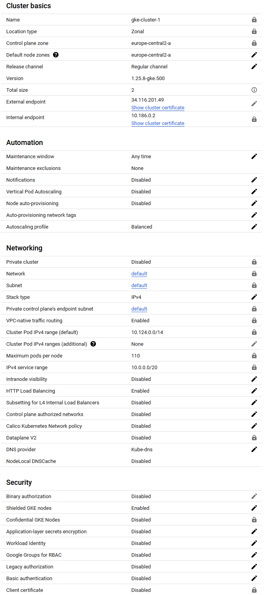

# CLD - LAB05 : Kubernetes
**Group S : A. David, T. Van Hove**

**Date : 25.05.2023**

**Teacher : Prof. Marcel Graf**

**Assistant : Rémi Poulard**

In the first part of this lab we will install a Kubernetes test cluster on our local machine, and deploy a "To Do" reminder application. This application will et complete three-tier application (Frontend, API Server and Redis) using Pods. In the second part, we will deploy the same application on GKE (Google Kubernetes Engine). Finally,we will make the application resilient to failures and deploy it to the Kubernetes cluster of the school.

> In this document, the objectives of each chapter, the questions that are asked to us and the deliverables are identified by a quote

### Table of content

[toc]

# Task 1 : Deploy the application on a local test cluster

> In this task you will set up a local Kubernetes test cluster and deploy an example application to it.
>
> The goal of the provided example application is to store and edit a To Do list. The application consists of a simple Web UI (Frontend) that uses a REST API (API service) to access a Key-Value storage service (Redis). Ports to be used for Pods and Services are shown in the figure.
>

## 1.1 & 1.2- Installation of Minikube & Kubectl

We had no problem installing Minikube and kubectl. Here is the screenshot showing the installed version :


## 1.3 - Create a one-node cluster on your local machine

The cluster creation process was easy to follow, and we did not have any issue doing it. The following screenshots shows the `minikube start` command and the cluster information, once it has been created.


## 1.4 - Deploy the application

Once again, we didn't encounter any issue deploying the application. 

### Kubernetes description

The following screenshot shows the Kubernetes service description:


### Deploy the Redis Service and Pod

The following screenshot shows the Redis deployment with the `redis-svc` and `redis-pod` with the config files :


The following screenshots show the description of the redis service and pod :


### Deploy the ToDo-API Service and Pod

We created the api-svc config file as asked in the lab :

```yaml
apiVersion: v1
kind: Service
metadata:
  labels:
    component: api
  name: api-svc
spec:
  ports:
  - port: 8081
    targetPort: 8081
    name: api
  selector:
    app: todo
    component: api
  type: ClusterIP
```

The following screenshot shows the deployment of the `api-svc` and `api-pod` with the config files. We can see that the service exposes the port 8081.


The following screenshot shows the description of the api service and pod


### Deploy the Frontend Pod

Here is our frontend-api configuration file. The `API_ENDPOINT_URL` environment variable should be set to the address of our API service within the Kubernetes cluster, so the URL would be `http://api-svc:8081`.

```yaml
apiVersion: v1
kind: Pod
metadata:
  name: frontend
  labels:
    component: frontend
    app: todo
spec:
  containers:
  - name: frontend
    image: icclabcna/ccp2-k8s-todo-frontend
    ports:
    - containerPort: 8080
    env:
    - name: API_ENDPOINT_URL
      value: "http://api-svc:8081"
```

Now we just have to deploy the frontend pod :


The following screenshot shows the description of the frontend pod :


### Verify the ToDo application

Then, using the kubectl port forwarding `kubectl port-forward frontend 8081:8080`, we can access the web app and see that it is served properly :


# Task 2 - Deploy the application in Kubernetes engine

> In this task you will deploy the application in the public cloud service Google Kubernetes Engine (GKE).

## 2.1 - Create Project & 2.2 Create a cluster

> Take a screenshot of the cluster details from the GKE console.

We did not have any issue creating the cluster in GKE. Once created, GKE details page looked like this :



## 2.3 - Deploy the application on the . cluster

We did not encounter any problems deploying the pods and services on the GKE cluster.

## 2.4 - Deploy the ToDo-Frontend Service

First, we created the frontend-svc.yaml configuration file :

```yaml
apiVersion: v1
kind: Service
metadata:
  labels:
    component: frontend
  name: frontend-svc
spec:
  type: LoadBalancer
  ports:
  - port: 80
    targetPort: 8080
    protocol: TCP
    name: http
  selector:
    app: todo
    component: frontend
```


Then, in order to deploy the cluster, we had to install the gcloud auth plugin with this command `gcloud components install gke-gcloud-auth-plugin`. 

> Copy the output of the `kubectl describe` command to describe your load balancer once completely initialized.
>
> Find out the public URL of the Frontend Service load balancer using `kubectl describe`.

Once we deploy the service with de command `kubectl create -f frontend-svc.yaml` we can get the load balancer IP to access the "todo" app using the command `kubectl describe service frontend-svc` :


For less details, we also can use the command `kubectl get frontend-svc` and retrieve the EXTERNAL-IP :


> Access the public URL of the Service with a browser. You should be able to access the complete application and create a new ToDo.

Finally we can access the deployed Todos app :


> Document any difficulties you faced and how you overcame them. Copy the object descriptions into the lab report (if they are unchanged from the previous task just say so).

Apart from the IP addresses, identifiers or dates, the other objects were not modified. We just added the frontend service. We provided the screenshot of the frontend service description earlier.

# Task 3 - Add and exercise resilience

> By now you should have understood the general principle of configuring, running and accessing applications in Kubernetes. However, the above application has no support for resilience. If a container (resp. Pod) dies, it stops working. Next, we add some resilience to the application.

## 3.1 Add deployments

Firstly, we had to delete existing pods with the commands :

````powershell
kubectl delete pod redis
kubectl delete pod api
kubectl delete pod frontend
````

Then we verified that our pods were actually deleted with the command  `kubectl get pods`.

Then, we had to create the 3 deployment configurations as follow. 

The "redis-deployment.yaml" file's content :

````yaml
apiVersion: apps/v1
kind: Deployment
metadata:
  name: redis-deployment
  labels:
    app: todo
    component: redis
spec:
  replicas: 1
  selector:
    matchLabels: # Used to determine which Pods are managed by this Deployment.
      app: todo
      component: redis
  template:
    metadata:
      labels:
        app: todo
        component: redis
    spec:
      containers:
      - name: redis
        image: redis
        ports:
        - containerPort: 6379
        args:
        - redis-server # Command to start the Redis server
        - --requirepass ccp2 #  Configures Redis to require a password 
        - --appendonly yes # Enables append-only mode to keep a log of all write operations
````

The "api-deployment.yaml" file's content :

````yaml
apiVersion: apps/v1
kind: Deployment
metadata:
  name: api-deployment
  labels:
    app: todo
    component: api
spec:
  replicas: 2
  selector:
    matchLabels:
      app: todo
      component: api
  template:
    metadata:
      labels:
        app: todo
        component: api
    spec:
      containers:
      - name: api
        image: icclabcna/ccp2-k8s-todo-api
        ports:
        - containerPort: 8081
        env:
        - name: REDIS_ENDPOINT
          value: redis-svc
        - name: REDIS_PWD
          value: ccp2
````

And the "frontend-deployment.yaml" file's content :

````yaml
apiVersion: apps/v1
kind: Deployment
metadata:
  name: frontend-deployment
  labels:
    app: todo
    component: frontend
spec:
  replicas: 2
  selector:
    matchLabels:
      app: todo
      component: frontend
  template:
    metadata:
      labels:
        app: todo
        component: frontend
    spec:
      containers:
      - name: frontend
        image: icclabcna/ccp2-k8s-todo-frontend
        ports:
        - containerPort: 8080
        env:
        - name: API_ENDPOINT_URL
          value: "http://api-svc:8081" # Internal URL of the API service within the cluster
````

> Use only 1 instance for the Redis-Server. Why?

If multiple instances want to write to multiple databases, we need to establish synchronization to ensure that all the data written to any of the databases is available for reading. However, we do not want to handle database synchronization ourselves. For such a small application, it would be excessive.

Once the configuration files are created, you simply need to deploy them using the `kubectl apply` command and then verify their availability :


> Verify that the application is still working and the Replica Sets are in place.

"redis-deployment" description :


"api-deployment" description :


"frontend-deployment" description (note that we have taken this screenshot after adding a frontend instance) :


All resources (note that we have taken this screenshot 4 days after the effective deployment on GKE) :


## 3.2 Verify the functionality of replica set

To achieve this, we will monitor the pods and delete 2 pods to observe the outcome.

We can observe in the screenshot below that when a pod is deleted, it is automatically recreated after deletion. The "api" pod was recreated within 3 seconds, and the "redis" pod within 7 seconds.


> What happens if you delete a Frontend or API Pod?

1. We delete the Pod using the `kubectl delete` command.
2. The Kubernetes API server receives the deletion request and marks the Pod for deletion.
3. The kubelet on the node where the Pod was running notices that the Pod has been marked for deletion, stops the Pod's containers, and then removes the Pod from the node.
4. The Deployment or ReplicaSet controller in the Kubernetes control plane notices that the number of running Pods is less than the desired number of replicas specified in the Deployment or ReplicaSet.
5. The Deployment or ReplicaSet controller creates a new Pod to replace the deleted one. It submits a request to the Kubernetes API server to create the new Pod.
6. The Kubernetes scheduler assigns the new Pod to a node, and the kubelet on that node starts the Pod.
7. The new Pod starts, and the application becomes available again.

> What happens when you delete the Redis Pod?

Exactly the same as any other pod, except that the system might take a little more time to recreate the pod.

> How long does it take for the system to react?

The time it takes to recreate a Pod depends on multiple things. For example for the redis pod:

1. **Image size**: Larger images take more time to be pulled from the registry. If the Redis image is larger than the API image, or if the Redis image is not already cached on the node where the new Pod is scheduled, it will take more time to pull the image, which could explain the delay.
2. **Startup time**: Indeed, certain applications take longer to start up than others. Redis, for example, may require some time to initialize its data structures, load data into memory, or perform other setup tasks. This initialization process can contribute to the additional time it takes for the application to become fully available.
3. **Pod scheduling**: The Kubernetes scheduler may take some time to schedule the pod based on the current workload, resource requests, and limits. It considers factors such as the current cluster load, resource requirements, and constraints before assigning a node to the pod. This scheduling process can introduce a delay as the scheduler evaluates the available resources and makes decisions to ensure optimal placement of the pod.
4. **Persistent storage**: If the Redis pod is configured with a persistent volume, the system may require additional time to detach the volume from the old pod and attach it to the new pod. This process involves ensuring data integrity and proper synchronization between the volume and the pod. Consequently, it can contribute to the delay in the pod becoming fully available.

> How can you change the number of instances temporarily to 3?

It is possible to change temporarily the number of instances with the `kubectl scale` command, for example: `kubectl scale deployment frontend-deployment --replicas=3`


These changes are temporary and will be lost the next time we apply the original Deployment configuration with `kubectl apply`. 

> What autoscaling features are available? Which metrics are used?

Kubernetes provides the ability to automatically scale our application based on various metrics using the Horizontal Pod Autoscaler (HPA) and Vertical Pod Autoscaler (VPA).

The HPA (Horizontal Pod Autoscaler) automatically adjusts the number of Pods in a replication controller, deployment, or replica set based on the observed CPU utilization or, with the support of custom metrics, other metrics provided by the application. The controller periodically adjusts the number of replicas in a deployment or replica set to match the average observed CPU utilization to the user-specified target. It can also adapt based on memory utilization and custom metrics (if custom metrics are configured in the cluster).

On the other hand, the `VPA` automatically adjusts the CPU and memory reservations for Pods to help "right-size" the application. It continuously analyzes the CPU and memory usage of the Pods and dynamically adjusts their CPU and memory requests if necessary. This can be particularly useful for applications with resource needs that change over time.

For `HPA`, the metrics used can be:

- **CPU Utilization**: This is the default metric. The target value is a percentage of the CPU request of the Pod containers.
- **Memory Utilization**: This is an optional metric that needs to be explicitly provided.
- **Custom Metrics**: Custom metrics are measurements that are not related to CPU and memory. They can be provided by the user or third-party services. Examples include request rate, response latency, etc.

The `VPA` utilizes historical data on CPU and memory usage to adjust the CPU and memory requests of the Pods. By analyzing past resource usage patterns, the `VPA` determines appropriate CPU and memory requests for the Pods, ensuring that they are provisioned with the necessary resources based on their historical utilization. This helps optimize resource allocation and improve efficiency in the application's resource utilization.


> How can you update a component?

Updating a deployment can be done by modifying the deployment's configuration file and applying these changes using `kubectl apply` command. The `kubectl apply` command updates the deployment to match the desired state defined in the configuration file. Kubernetes will automatically perform a rolling update to achieve the desired state. This means it will gradually replace the old pods with the new ones, ensuring that the application remains available during the update process.

If we are updating the image to deploy a new version of our application, we can also use the `kubectl set image` command to directly update the image without editing the configuration file. For example:

```bash
kubectl set image deployment/api-deployment api=icclabcna/ccp2-k8s-todo-api:v2
```

This command updates the `api` container in the `api-deployment` deployment to use the `icclabcna/ccp2-k8s-todo-api:v2` image.

# Task 4 - Deploy on IICT Kubernetes cluster

> To show you that once you have your *YAML* file you can deploy  your app on any Kubernetes cluster without any changes, you will do the  same as task 3 but on the Kubernetes cluster of IICT. **You must be on VPN to access the IICT Kubernetes cluster, even in the school.**

## 4.1- setup kubectl

We had encountered no problems setting-up the kubectl configuration and connecting to the iict rancher website.

## 4.2 - Deploy the application

> Document your observations in the lab report. Document any difficulties you faced and how you overcame them. Copy the object descriptions into the lab report

For the deployment, we did exactly as we did for the GKE deployment, expect adding the namespace parameter in the commands. Here is a snapshot showing the deployment of the app and the status of the deployment:


Here are the screenshots of the redis service and the redis deployment descriptions :


Here are the screenshots of the api service and the api deployment descriptions :


Here are the screenshots of the frontend service and the frontend deployment descriptions :


Finally, we were able to access the todos application using the IP address displayed in
the frontend service description `10.192.129.207`:

