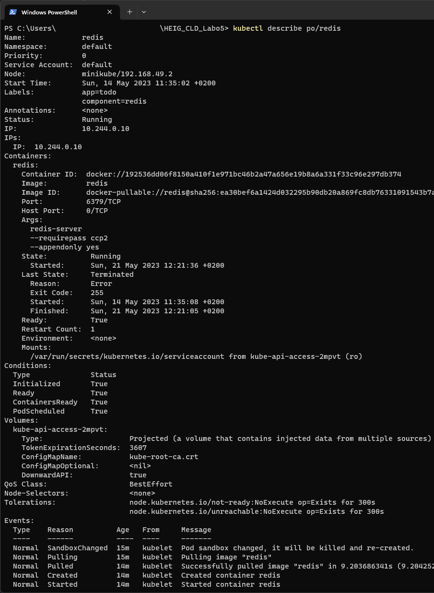

# CLD - LAB05 : Kubernetes
**Group R : A. David, T. Van Hove**

**Date : 25.05.2023**

**Teacher : Prof. Marcel Graf**

**Assistant : Rémi Poulard**

In this lab we will install a Kubernetes test cluster on our local. Then, we will deploy a rovided "To Do" reminder application. This application will et complete three-tier application (Frontend, API Server and Redis) using Pods.

In the second part of this lab, we will deploy the same application on a public cloud service who run Kebernetes (Google Kubernetes Engine).

Finally, in the third part of this lab, we will make the application resilient to failures.

### Table of content

[toc]

# Task 1 : Deploy the application on a local test cluster

In this task, we will set up a local Kubernetes test cluster and deploy an example application to it.

## Subtask 1.1 & 1.2- Installation of Minikube & Kubectl

We had no problem installing Minikube and kubectl. Here is the screenshot showing the installed version :


## Subtask 1.3 - Creating a one-node cluster on our local machine

The cluster creation process was easy to follow, and we did not have any issue doing it. The following screenshots shows the `minikube start` command and the cluster information, once it has been created.


## Subtask 1.4 - Deploy the application

Once again, we didn't encounter any issue deploying the application. 

### Kubernetes description

The following screenshot shows the Kubernetes service description:


### Redis deployment & description

The following image shows the Redis deployment with the `redis-svc` and `redis-pod` with config files:


The following screenshot shows the description of the redis service and pod:




### Api deployment & description

We created the api-svc config file as asked in the lab:

```yaml
apiVersion: v1
kind: Service
metadata:
  labels:
    component: api
  name: api-svc
spec:
  ports:
  - port: 8081
    targetPort: 8081
    name: api
  selector:
    app: todo
    component: api
  type: ClusterIP
```

The following screenshot shows the deployment of the `api-svc` and `api-pod` with the config files. We can see that the service exposes the port 8081.


The following screenshot shows the description of the api service and pod


### Front-end deployment & description

Here is our frontend-api configuration file. The `API_ENDPOINT_URL` environment variable should be set to the address of our API service within the Kubernetes cluster, so the URL would be `http://api-svc:8081`.

```yaml
apiVersion: v1
kind: Pod
metadata:
  name: frontend
  labels:
    component: frontend
    app: todo
spec:
  containers:
  - name: frontend
    image: icclabcna/ccp2-k8s-todo-frontend
    ports:
    - containerPort: 8080
    env:
    - name: API_ENDPOINT_URL
      value: "http://api-svc:8081"
```

Now we just have to deploy the frontend pod:


The following screenshot shows the description of the frontend pod :


Then, using the kubectl port forwarding `kubectl port-forward frontend 8081:8080`, we can access the web app and see that it is served properly:


# Task 2 - Deploy the application in Kubernetes engine

We did not have any difficulty creating the cluster in GKE. Once created, GKE details page looked like this:


Then we created the frontend-svc.yaml configuration file:

```yaml
apiVersion: v1
kind: Service
metadata:
  labels:
    component: frontend
  name: frontend-svc
spec:
  type: LoadBalancer
  ports:
  - port: 80
    targetPort: 8080
    protocol: TCP
    name: http
  selector:
    app: todo
    component: frontend
```


In order to deploy the cluster, we had to install the gcloud auth plugin with this command `gcloud components install gke-gcloud-auth-plugin`. 

Once we deploy the service with de command `kubectl create -f frontend-svc.yaml` we can get the load balancer IP to access the todo app using the command `kubectl describe service frontend-svc`. 


or for less details, with de command `kubectl get frontend-svc` and retrieve the EXTERNAL-IP. 


Finally we can access the deployed Todos app


# Task 3 - Add and exercise resilience

Firstly we had to delete existing pods with the commands

````powershell
kubectl delete pod redis
kubectl delete pod api
kubectl delete pod frontend
````

Then we verified that our pods were actually deleted with the command  `kubectl get pods`

## 3.1 Add deployments

Then we had to create the 3 deployment configurations as follow:

redis-deployment.yaml:

````yaml
apiVersion: apps/v1
kind: Deployment
metadata:
  name: redis-deployment
  labels:
    app: todo
    component: redis
spec:
  replicas: 1
  selector:
    matchLabels: # Used to determine which Pods are managed by this Deployment.
      app: todo
      component: redis
  template:
    metadata:
      labels:
        app: todo
        component: redis
    spec:
      containers:
      - name: redis
        image: redis
        ports:
        - containerPort: 6379
        args:
        - redis-server # Command to start the Redis server
        - --requirepass ccp2 #  Configures Redis to require a password 
        - --appendonly yes # Enables append-only mode to keep a log of all write operations
````

api-deployment.yaml:

````yaml
apiVersion: apps/v1
kind: Deployment
metadata:
  name: api-deployment
  labels:
    app: todo
    component: api
spec:
  replicas: 2
  selector:
    matchLabels:
      app: todo
      component: api
  template:
    metadata:
      labels:
        app: todo
        component: api
    spec:
      containers:
      - name: api
        image: icclabcna/ccp2-k8s-todo-api
        ports:
        - containerPort: 8081
        env:
        - name: REDIS_ENDPOINT
          value: redis-svc
        - name: REDIS_PWD
          value: ccp2
````

frontend-deployment.yaml:

````yaml
apiVersion: apps/v1
kind: Deployment
metadata:
  name: frontend-deployment
  labels:
    app: todo
    component: frontend
spec:
  replicas: 2
  selector:
    matchLabels:
      app: todo
      component: frontend
  template:
    metadata:
      labels:
        app: todo
        component: frontend
    spec:
      containers:
      - name: frontend
        image: icclabcna/ccp2-k8s-todo-frontend
        ports:
        - containerPort: 8080
        env:
        - name: API_ENDPOINT_URL
          value: "http://api-svc:8081" # Internal URL of the API service within the cluster
````

### Use only 1 instance for the Redis-Server. Why?

If multiple instances wants to write in multiple databases, we need to set a synchronization to be sure that all the data written in any of the database are available to be read. But we don't want to manage database synchronization. For a so small application it would be overkill.

One the configuration files created, we only have to deploy them using `kubectl apply` command, and see if they are available :


### Verify that the application is still working and the Replica Sets are in place.

redis deployment description:


api deployment description:


frontend deployment description (note that we have taken this screenshot after adding a frontend instance):


All resources (note that we have taken this screenshot 4 days after the effective deployment on GKE):


## 3.2 Verify the functionality of replica set

In order to do that, we will monitor the pods and delete 2 pods to see what appends.

We can see in the screenshot below that when we delete a pod, it is automatically recreated after deletion. The api pod has been recreated in 3 seconds and the redis pod in 7 seconds.


Here is what appends when we delete a pod:

1. We delete the Pod, either using `kubectl delete`.
2. The Kubernetes API server receives the deletion request and marks the Pod for deletion.
3. The kubelet on the node where the Pod was running notices that the Pod has been marked for deletion, stops the Pod's containers, and then removes the Pod from the node.
4. The Deployment or ReplicaSet controller in the Kubernetes control plane notices that the number of running Pods is less than the desired number of replicas specified in the Deployment or ReplicaSet.
5. The Deployment or ReplicaSet controller creates a new Pod to replace the deleted one. It submits a request to the Kubernetes API server to create the new Pod.
6. The Kubernetes scheduler assigns the new Pod to a node, and the kubelet on that node starts the Pod.
7. The new Pod starts, and the application becomes available again.

The time it takes to recreate a Pod depends on multiple things:

1. **Image size**: Larger images take longer to pull from the registry. If the Redis image is larger than the api image, or if the Redis image is not already cached on the node where the new Pod is being scheduled, it will take longer to pull the image, which could explain the delay.
2. **Startup time**: Some applications take longer to start up than others. Redis, for example, may take some time to initialize its data structures, load data into memory, or perform other setup tasks.
3. **Pod scheduling**: Kubernetes scheduler might take some time to schedule the pod depending on the current load, resource requests and limits.
4. **Persistent storage**: If the Redis Pod is configured with a Persistent Volume, the system might need additional time to detach the volume from the old Pod and attach it to the new Pod.

### Changing the number of instances

It is possible to change temporarily the number of instances with the `kubectl scale` command, for example: `kubectl scale deployment frontend-deployment --replicas=3`


These changes are temporary and will be lost the next time we apply the original Deployment configuration with `kubectl apply`. 

### Autoscaling features

Kubernetes provides the capability to automatically scale our application based on different metrics of the Horizontal Pod Autoscaler (HPA) and the Vertical Pod Autoscaler (VPA).

`HPA` automatically scales the number of Pods in a replication controller, deployment or replica set based on observed CPU utilization or, with custom metrics support, on some other application-provided metrics. The controller periodically adjusts the number of replicas in a Deployment or ReplicaSet to match the observed average CPU utilization to the target specified by the user. It can also scale based on memory usage and custom metrics (if custom metrics are set up in the cluster).

On the other hand, `VPA` automatically adjusts the CPU and memory reservations for the Pods to help "right size" the application. It continually analyzes the CPU and memory usage of Pods and dynamically adjusts their CPU and memory requests as necessary. This can be useful for applications that have changing resource requirements over time.

For `HPA`, the metrics used can be:

- **CPU Utilization**: This is the default metric. The target value is a percentage of the CPU request of the Pod containers.
- **Memory Utilization**: This is an optional metric and it has to be provided explicitly.
- **Custom Metrics**: Custom metrics are metrics not related to CPU and memory. These can be provided by the user or third-party services. Examples include request rate, response latency, etc.

`VPA` uses historical CPU and memory usage data to adjust the CPU and memory requests of the Pods.

### Updating a component

Updating a Deployment can be done by changing the Deployment configuration file and applying those changes with `kubectl apply`. The `kubectl apply` command updates the Deployment to match the state defined in the configuration file. Kubernetes will then automatically perform a rolling update to achieve the desired state. This means it will gradually replace old Pods with new ones, ensuring that the application remains available during the update.

If we're updating the image to deploy a new version of our application, we can also use the `kubectl set image` command to update the image directly without editing the configuration file. For example:

```bash
kubectl set image deployment/api-deployment api=icclabcna/ccp2-k8s-todo-api:v2
```

This command updates the `api` container in the `api-deployment` Deployment to use the `icclabcna/ccp2-k8s-todo-api:v2` image. Replace `v2` with our actual new version.

# Task 4 - Deploy on IICT Kubernetes cluster


